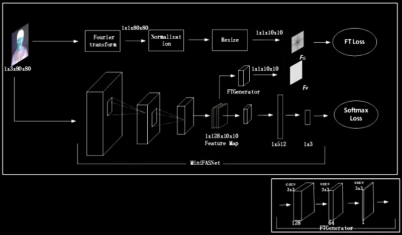

## 1. Statistical and Mathematical Foundations

### 1.1 Continuous vs. Discrete Functions

Conceptually, an ideal image is modeled as a continuous intensity function of two variables, $f(x, y)$, where $x$ and $y$ represent spatial coordinates and $f(x, y)$ corresponds to the light intensity. Because digital systems cannot process continuous data, discretization is required through two primary stages:
- Sampling: The process of discretizing the spatial domain into a finite two-dimensional grid of pixels. Higher sampling density allows for finer spatial details.
- Quantization: Mapping continuous intensity values at each sampled point to a discrete level (e.g., 256 levels for 8-bit images).
Inadequate sampling leads to aliasing (moiré effects), while insufficient quantization results in false contouring or banding.

### 1.2 Probability and Statistics in Image Processing
Images are often corrupted by stochastic noise caused by sensor limitations or lighting. Noise reduction techniques are chosen based on the noise's probability distribution:
- Gaussian Noise: Often represents thermal sensor noise; the Mean Filter is effective here by averaging pixels to suppress random fluctuations.
- Salt-and-Pepper Noise: Impulsive noise where pixels take on max/min values; the Median Filter is superior as it is robust against these outliers.
- Advanced Statistical Filters: Tools like the Wiener Filter use second-order statistics (mean and variance) to minimize the Mean Square Error (MSE).

### 1.3 Mathematical Transformations
Mathematical transforms allow image analysis in different domains. The Fourier Transform shifts an image from the spatial domain to the frequency domain:
- Low-frequency: Corresponds to slow variations like global lighting.
- High-frequency: Corresponds to rapid changes like edges and noise.

---

## 2. Image Processing Concepts and AI-Based Application

### 2.1 Real-World Case Study: Facial Recognition Attendance
The image processing pipeline for modern attendance systems involves several critical stages:
- Image Pre-processing: Resizing, intensity normalization, and noise reduction to standardize input for AI models.
- Face Detection: Localizing facial regions using classical methods like Haar Cascades or modern Convolutional Neural Networks (CNNs).
- Feature Extraction: CNNs map facial characteristics into a high-dimensional numerical vector called an embedding.
- Face Recognition: Comparing the embedding against a database using similarity measurements like cosine similarity.

### 2.2 Industrial Scalability and Security

To ensure reliability in industrial contexts, systems must address security through Face Anti-Spoofing (Liveness Detection). This prevents fraud from photos or screens by analyzing the Fourier spectrum to detect "fake" textures.

Architectures like Silent-Face-Anti-Spoofing use a dual-branch approach:
- Main Branch (MiniFASNet): Processes spatial features to categorize the input.
- Auxiliary Branch: Leverages the Fourier Transform to find frequency inconsistencies, such as moiré patterns on digital screens, that are invisible to the human eye.

*Architecture of spoofing detection using Fourier spectrum, from [Silent-Face-Anti-Spoofing](https://github.com/minivision-ai/Silent-Face-Anti-Spoofing/)*

---

## 3. Links

Read full (PDF): [Scribd](https://www.scribd.com/document/981399123/Image-Processing-AI-Applications) - [GDrive](https://drive.google.com/file/d/1Woyi_Y3tEBgYwk8OoKLyl9sp5KUri-qn/view?usp=sharing)