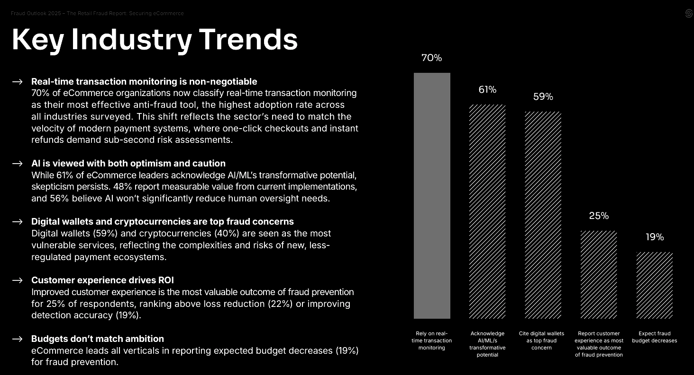

## 1. Introduction

The rapid growth of online shopping has increased opportunities for fraudulent websites that deceive consumers and disappear before they can be held accountable. These sites often use professional interfaces and realistic branding, making manual detection difficult. This study investigates how publicly observable attributes—such as domain registration patterns, SSL certificate metadata, and external reputation signals—can be used to distinguish fraudulent e-commerce sites from legitimate ones through interpretable machine learning.

*Ecommerce Fraud Outlook 2025 by SEON, from [report](https://seon.io/wp-content/uploads/2025/07/Fraud-Outlook-2025-The-Retail-Fraud-Report-Securing-eCommerce_V3.pdf)*

---

## 2. Dataset Overview

The study utilizes the "Fraudulent Online Shops Detection" dataset, containing 1,140 URLs. The data is nearly balanced, which allows for unbiased model training:
- Fraudulent sites: 579 (50.8%) 
- Legitimate sites: 561 (49.2%) 

Source: [Mendeley Data](https://data.mendeley.com/datasets/m7xtkx7g5m/1)

Feature Categories
The 26 original variables are grouped into four primary categories:
- Domain & URL Structure: Length, number of special characters (dots, hyphens), and prefixes.
- Payment & Contact Indicators: Availability of credit card/crypto payments, money-back guarantees, and the use of free email contacts.
- SSL Certificate Metadata: Issuer class, expiry dates, and "young domain" indicators.
- External Reputation: Presence and scores on platforms like TrustPilot, SiteJabber, and the Tranco traffic list.

---

## 3. Key Fraud Indicators

Exploratory analysis revealed several consistent patterns that signal high fraud risk:
- Domain Irregularities: Fraudulent domains are often shorter and use a higher density of hyphens and dots to mimic brands cheaply.
- Temporal Cues: These sites are disproportionately newer ("young domains") and use SSL certificates with short expiration horizons.
- Superficial Legitimacy: Fraudulent sites frequently claim money-back guarantees and list many credit card options but often lack official logos and use free email addresses for contact.
- Reputation "Gaps": A lack of established history on review platforms or traffic rankings is a strong correlation for fraud

---

## 4. Modelling & Performance

The study evaluated three algorithms to balance predictive power with the need for explainable results:
- Logistic Regression: Provided a transparent baseline for feature influence.
- Random Forest: Selected as the final model for its stability, ability to handle non-linear patterns, and clear feature importance rankings.
- XGBoost: Offered high performance for picking up subtle feature interactions.

Performance Summary
| Model               | Accuracy | F1 Score | AUC   |
|---------------------|----------|----------|-------|
| Logistic Regression | 0.917    | 0.918    | 0.981 |
| Random Forest       | 0.930    | 0.930    | 0.982 |
| XGBoost             | 0.921    | 0.922    | 0.981 |

---

## 5. Risk Scoring Framework

To make the model practical for real-world deployment, a scoring architecture converts probabilities into actionable tiers:
- High Risk (≥ 80): Strong fraud indicators; immediate action or block recommended.
- Medium Risk (30-79): Mixed signals; requires manual review.
- Low Risk (< 30): Minimal fraud signals; likely legitimate.

The project includes a Command-Line Interface (CLI) tool that allows analysts to score single records or process large batches of URLs via CSV, ensuring the same preprocessing logic used in training is applied in production.

---

## 6. Conclusion

By prioritizing interpretability, this study moves beyond "black-box" predictions. The resulting model not only identifies fraudulent sites with 93% accuracy but also explains why a site is risky—citing factors like domain age, SSL longevity, and reputation gaps. This transparency is essential for building trust in automated security systems.

---

7. Links

- Read full (PDF): [Scribd](https://www.scribd.com/document/967612775/E-commerce-Fraud-Risk-Scoring-System) - [GDrive](https://drive.google.com/file/d/1hQX0cwzRlrctQf_8nteNyJjtKltWi6Cq/view?usp=drive_link)
- Github: [ecom-fraud-risk-scoring](https://github.com/rafifmsn/ecom-fraud-risk-scoring)
- Website: [efr-scoring.streamlit.app](https://efr-scoring.streamlit.app)